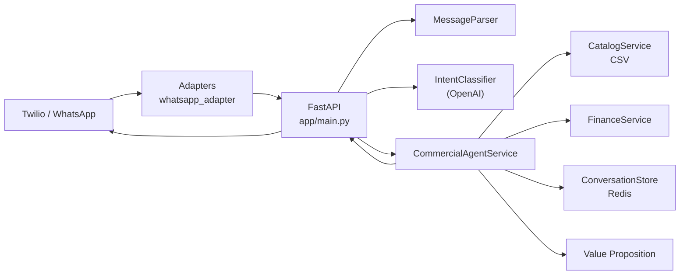

# Diagrama de Arquitectura

```mermaid
flowchart LR
    T["Twilio / WhatsApp"] --> A["Adapters<br/>whatsapp_adapter"]
    A --> API["FastAPI<br/>app/main.py"]
    API --> PARSER[MessageParser]
    API --> CLASSIFIER["IntentClassifier<br/>(OpenAI)"]
    API --> AGENT[CommercialAgentService]
    AGENT --> CATALOG["CatalogService<br/>CSV"]
    AGENT --> FINANCE[FinanceService]
    AGENT --> REDIS["ConversationStore<br/>Redis"]
    AGENT --> VALUE[Value Proposition]
    AGENT --> API
    API --> T
```
