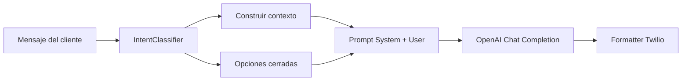

# Diagrama de Flujo de Prompts

```mermaid
flowchart LR
    MSG[Mensaje del cliente] --> CLASSIFY[IntentClassifier]
    CLASSIFY --> CONTEXT[Construir contexto]
    CLASSIFY --> SLOTS[Opciones cerradas]
    CONTEXT --> PROMPT[Prompt System + User]
    SLOTS --> PROMPT
    PROMPT --> LLM[OpenAI Chat Completion]
    LLM --> ADAPTER[Formatter Twilio]
```
